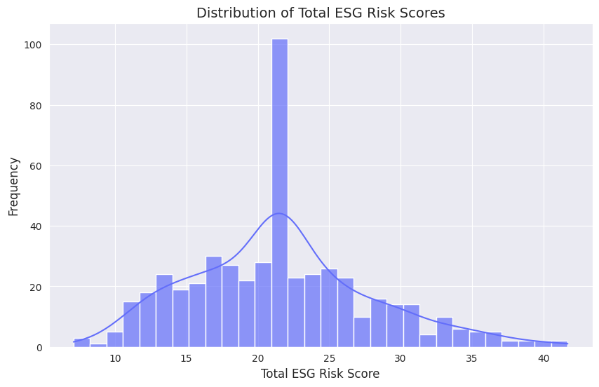
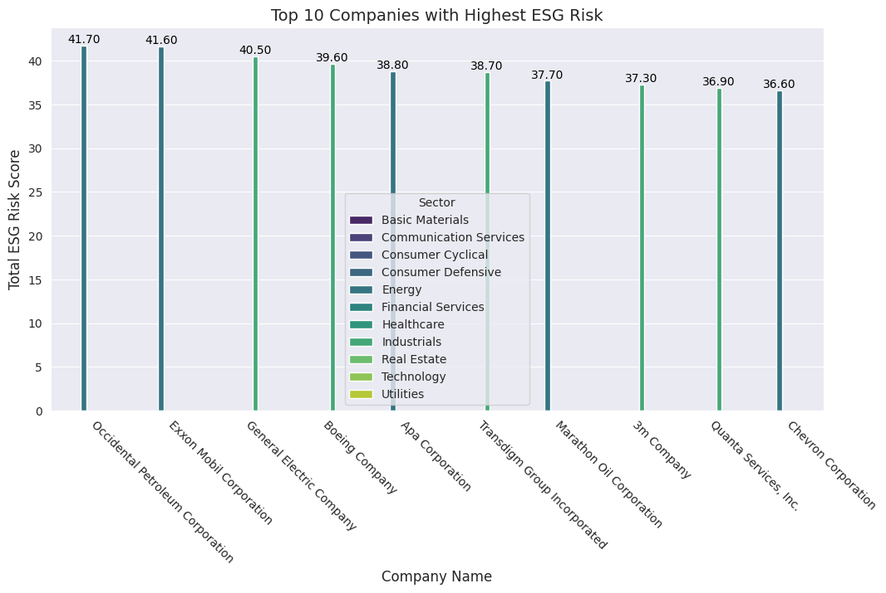
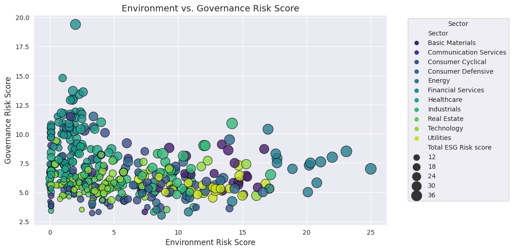
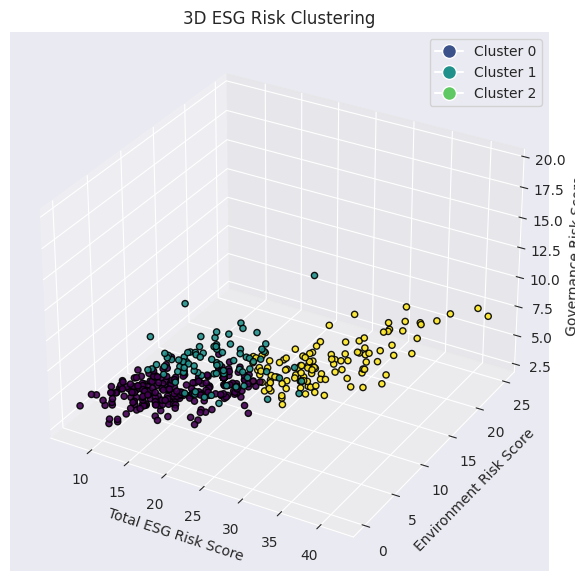
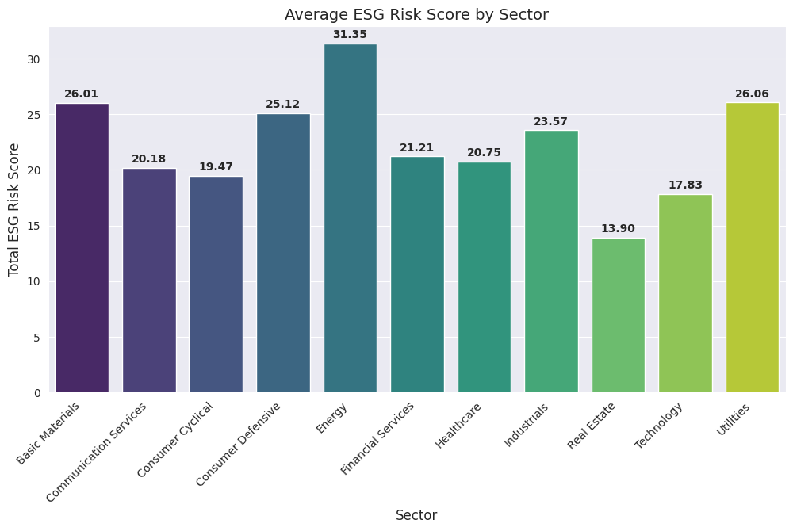
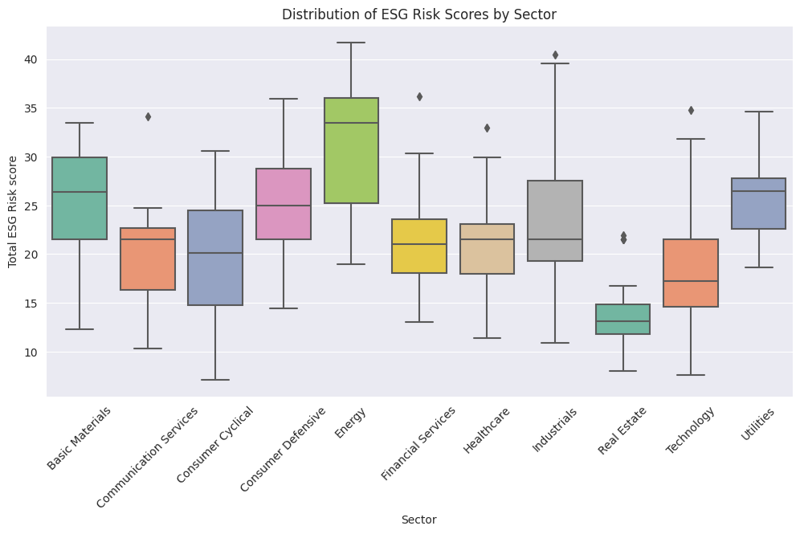
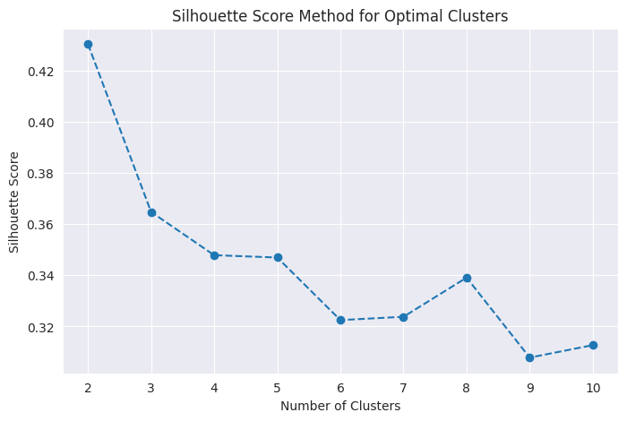

# ESG Risk Analysis: Uncovering Sectoral and Governance Patterns

## Understanding the ESG Risk Landscape

The first visualization presents a **distribution of total ESG risk scores**, showing how companies are spread across different risk levels. Most companies seem to cluster between scores of **15 to 30**, indicating that moderate risk levels are the most common.

## The High-Risk Players

A **bar chart of the top 10 companies with the highest ESG risk** reveals those facing the most significant sustainability challenges. The highest risk company holds a score of **41.70**, with sectors like **Basic Materials, Consumer Cyclical, and Energy** dominating the top spots.

## Governance vs. Environmental Risk: The Trade-Off

A scatter plot compares **environmental and governance risk scores** across industries. It highlights that some sectors maintain strong governance structures but struggle with environmental impact, while others have balanced risks. **Technology and Financial Services** appear to manage governance risk better than **Energy and Industrials**.

## Clustering ESG Risk Profiles

A **3D ESG Risk Clustering model** categorizes companies into distinct groups based on their ESG scores. This approach helps in identifying patterns and potential industry-wide risk mitigation strategies.

## Which Sectors Face the Most ESG Risk?

Sector-wise breakdowns show that **Basic Materials and Energy** have the highest **average ESG risk scores**, exceeding **30**, while sectors like **Technology and Healthcare** maintain lower risk profiles around **13-18**.

## Optimal Clustering for ESG Insights

Using **silhouette scores**, the analysis identifies the best number of clusters for segmenting ESG risk profiles. The optimal cluster count appears to be **between 2 and 4**, suggesting distinct ESG risk groups among companies.

## Sector-Wise ESG Risk Distribution

Visualizing ESG scores within each sector provides deeper insights into **which industries have the widest risk variations**. Some sectors exhibit **uniform risk distributions**, while others have **highly varied risk scores**, indicating potential outliers or companies making significant sustainability efforts.
